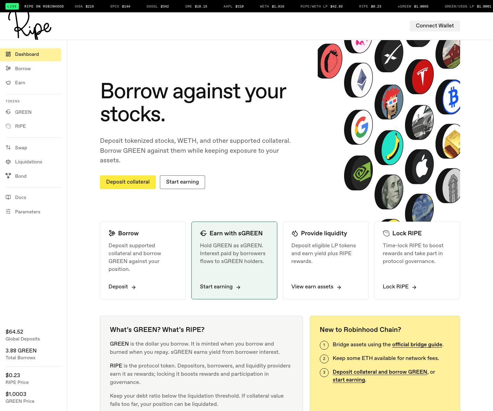

# 시작하기

Ripe 사용법을 알려주는 간단한 튜토리얼입니다. [프로토콜 문서](../README.md)는 Ripe의 작동 원리를 설명하고, 이 가이드는 무엇을 클릭해야 하는지 안내합니다. 각 가이드는 따로 읽어도 이해할 수 있습니다.

예치, 대출, 상환, 수익 창출 흐름은 Ripe가 운영되는 모든 네트워크에서 같습니다. 스크린샷은 한 배포 네트워크에서 촬영했으므로, 앱에서 선택한 네트워크에 따라 실제 토큰 이름, 페어, 조건은 달라집니다. 앱의 표와 [Params](https://params.ripe.finance)에서 항상 최신 정보를 확인하세요.

세 가지가 필요합니다. Ripe가 배포된 네트워크에 연결된 지갑, 해당 네트워크의 가스 토큰 소량(현재 배포 네트워크에서는 ETH), 그리고 예치할 자산입니다. 가능하면 주식 토큰으로 시작해 보세요.

**1단계.** 해당 네트워크의 공식 문서를 사용해 지갑에 네트워크를 추가하세요. 검색 결과나 DM으로 받은 네트워크 설정은 절대 사용하지 마세요.

**2단계.** 해당 네트워크의 공식 브릿지로 가스 토큰을 조금 옮기세요. 일부는 남겨 두세요. 예치, 대출, 청구는 모두 트랜잭션입니다.

**3단계.** 예치할 주식 토큰을 준비하세요. 두 가지 규칙이 있습니다.

* 발행사의 공식 토큰 레지스트리에서 **컨트랙트 주소를 확인**하고, 같은 토큰이 Ripe 앱의 Borrow 표에도 표시되는지 확인하세요. 예를 들어 Robinhood는 [docs.robinhood.com/chain/contracts](https://docs.robinhood.com/chain/contracts/)에 Stock Token 레지스트리를 공개합니다. 이름과 심볼이 같은 가짜 토큰이 있을 수 있습니다. 다른 곳에서 주소를 찾았다면 사용하지 마세요.
* **발행사 약관을 확인하세요.** Ripe는 발행사가 아니며, 토큰 보유 자격은 각 발행사가 정합니다. [Ripe의 주식 토큰](../core-protocol/00-stock-tokens.md)은 주식 토큰이 Ripe 안에서 무엇을 의미하는지, 발행사의 상품 약관은 어디에서 읽을 수 있는지 설명합니다.

이미 지갑에 주식 토큰이 있다면 준비가 끝났습니다. 그래도 가스 토큰은 필요합니다.

다음: [주식 토큰 예치하기](02-deposit-collateral.md).
