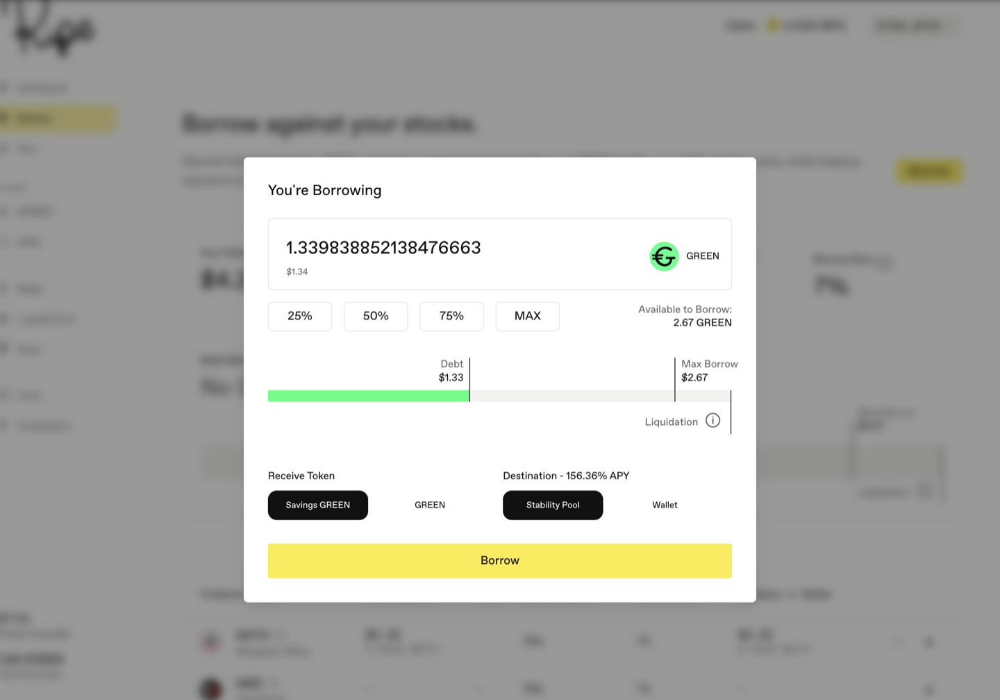
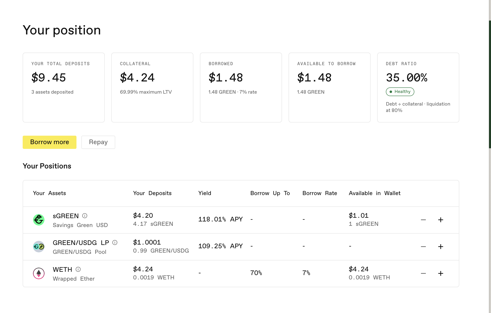

# GREEN 대출받기

[GREEN](../core-protocol/01-green-stablecoin.md)은 예치 자산을 담보로 대출받는 달러 스테이블코인입니다. 앱의 표에는 각 자산의 금리와 대출 한도가 표시되며, 거래를 확인하기 전에는 본인 포지션의 수치도 확인할 수 있습니다.

**1단계.** 담보를 예치한 상태로 **Borrow** 페이지에 머무르세요. 위쪽 패널에서 Your Total Deposits, Your Total Collateral, Outstanding Debt, Available to Borrow, Borrow Rate를 확인할 수 있습니다.

**2단계.** 패널 오른쪽 위의 **Borrow**를 누르세요.

**3단계.** 금액을 입력하세요. 최대 금액보다 충분히 적게 대출받으세요. 가격은 움직이며, 적게 대출받을수록 가격 변동 후에도 포지션이 더 건전합니다. 입력하는 동안 막대에서 부채와 Max Borrow 및 Liquidation 기준을 비교할 수 있습니다.

**4단계.** 무엇을 받고 어디로 보낼지 선택하세요. 놓치기 쉽지만 중요한 부분입니다.

* **Receive Token:** 일반 스테이블코인인 **GREEN**, 또는 프로토콜 수익에 따라 GREEN 가치가 올라가는 **Savings GREEN**([sGREEN](../earning-and-rewards/01-sgreen.md))을 선택합니다.
* **Destination:** **Wallet**, 또는 바로 [수익을 창출](../earning-and-rewards/02-stability-pools.md)할 **Stability Pool**을 선택합니다. Stability Pool 옵션은 Savings GREEN에만 적용됩니다. 대출받은 GREEN을 sGREEN으로 전환하고 한 번에 안정화 풀에 예치합니다. 일반 GREEN은 항상 지갑으로 전송됩니다.

사용하기 위해 대출받는다면 GREEN과 Wallet을 선택하세요. 수익을 위해 대출받는다면 Savings GREEN과 Stability Pool을 선택하면 별도의 예치 거래를 줄일 수 있습니다.

**5단계.** **Borrow**를 누르고 지갑에서 거래를 확인하세요.

**그다음 확인할 항목:** Borrow 페이지의 Debt Status와 대시보드의 Debt Ratio입니다. 대출 전에는 **No Debt**, 여유가 충분한 동안에는 **Healthy**로 표시되며, 부채가 Max Borrow 및 Liquidation 기준과 함께 나타납니다. 담보 가치가 충분히 하락하면 포지션이 [청산](../core-protocol/04-liquidations.md)될 수 있습니다.

대시보드의 **Debt Ratio** 카드에도 같은 포지션이 표시됩니다. 이 카드에서는 계산 방식과 청산이 시작되는 비율을 자세히 설명합니다. 같은 정보를 두 가지 표현으로 보여주는 것입니다.

**주식 담보는 주말에 다르게 움직입니다.** 주식 가격 피드는 시장 거래 시간을 따릅니다. 시장이 닫히면 피드의 유효 시간이 허용하는 동안 Ripe는 주식 담보의 마지막 가격을 유지합니다. 유효 시간이 먼저 끝나면 시장이 다시 열릴 때까지 토큰 가격을 사용할 수 없고, 계정은 상환만 가능한 상태로 기다립니다. 금요일 가격이 유지된다고 해서 그동안 안전하다는 뜻은 아닙니다. 피드가 멈출 때 이미 청산 기준치에 도달했거나, WETH처럼 계속 움직이는 다른 담보가 충분히 하락해 포지션을 청산 기준치까지 끌어내리면 이 기간에도 청산될 수 있습니다.

시장이 다시 열리면 주가는 서서히 움직이는 대신 한 번에 업데이트됩니다. 휴장 중 주가가 하락했다면 포지션이 전체 하락분을 한꺼번에 흡수합니다. 주말 가격 공백이 포지션의 운명을 결정하지 않도록 충분한 여유를 두고 대출받으세요. 가격이 완전히 사라지는 경우까지 포함한 전체 설명은 [Ripe의 주식 토큰](../core-protocol/00-stock-tokens.md#거래-시간과-주말-공백)을 참조하세요.

다음: [상환하고 출금하기](04-pay-back-and-withdraw.md).
