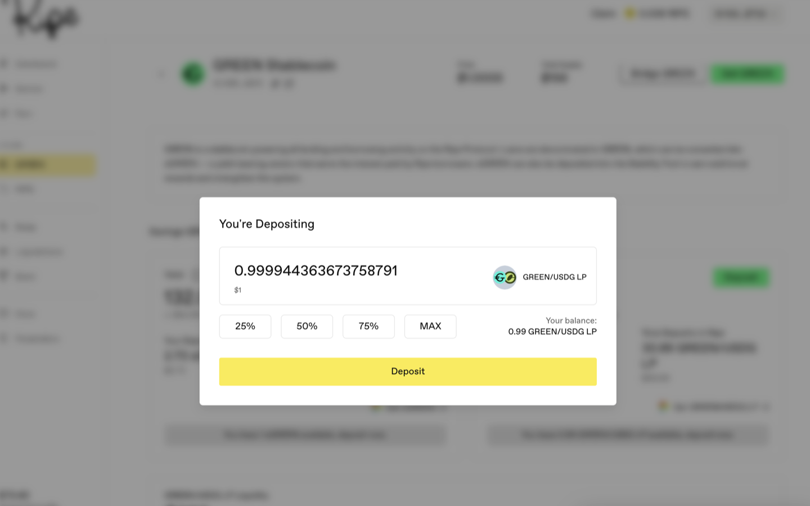
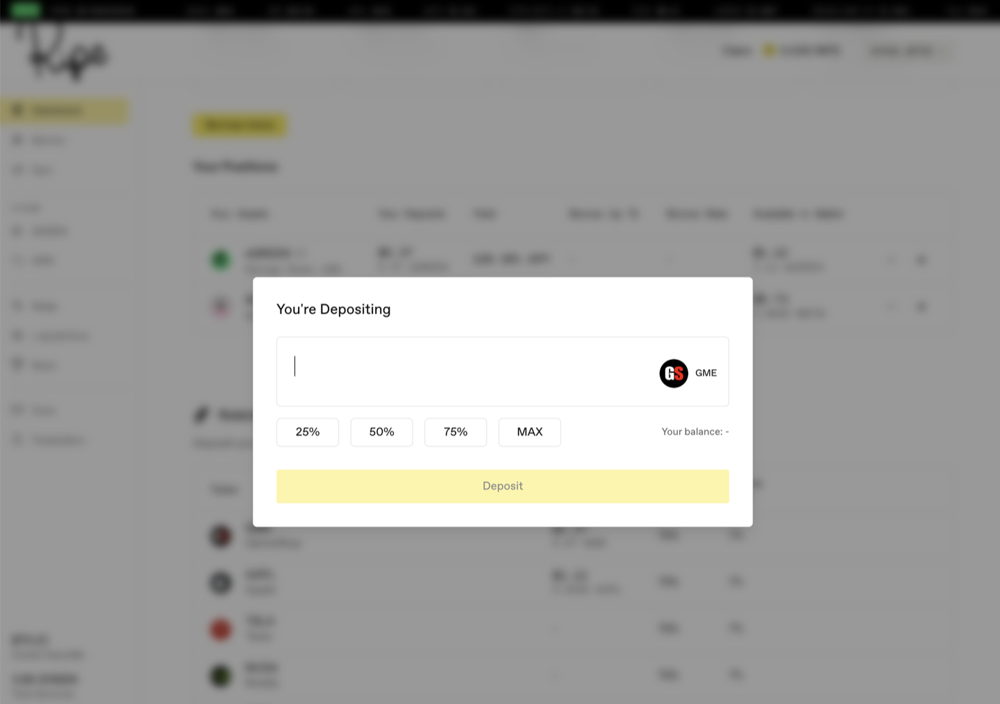
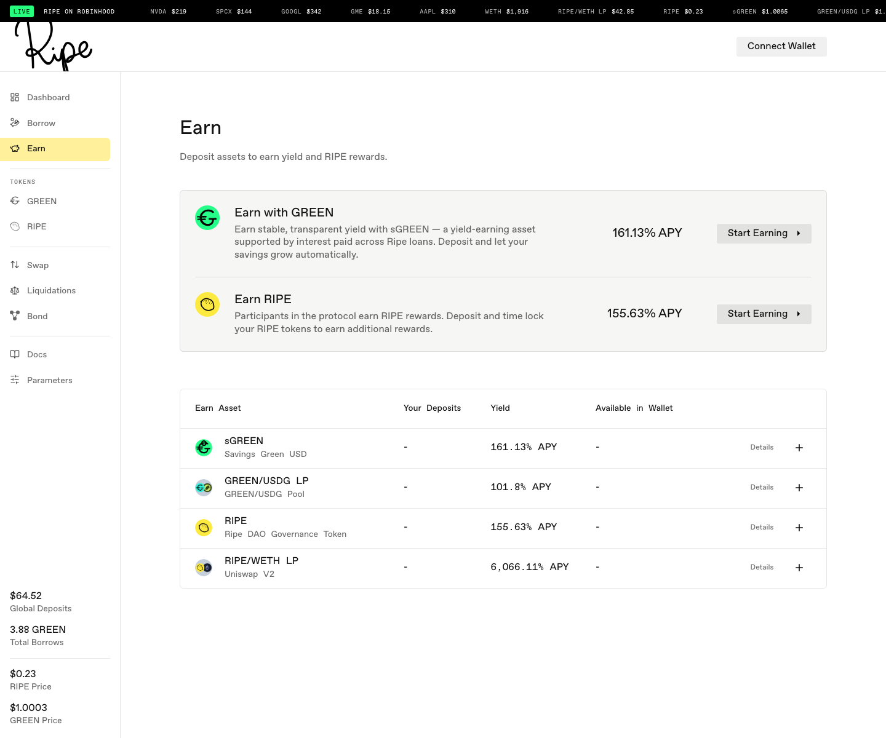

# GREEN을 구하고 유동성 공급하기

GREEN 스테이블코인 풀의 유동성 공급자는 LP 토큰을 [안정화 풀](../earning-and-rewards/02-stability-pools.md)에 예치하고 [RIPE 보상](../earning-and-rewards/03-ripe-rewards.md)을 받습니다. 페어는 네트워크마다 다릅니다. 스크린샷은 Curve의 GREEN/USDG를 보여주므로 아래에서는 이를 예시로 사용합니다.

**1단계.** GREEN을 구하세요. 두 가지 방법이 있습니다. [GREEN을 대출](03-borrow-green.md)받거나, GREEN 페이지에서 **Get GREEN**을 눌러 스왑하세요.

**2단계.** 페어의 다른 자산을 구하세요. 이 예시에서는 USDG입니다. DEX에서 스왑하거나 브릿지로 옮기세요.

**3단계.** 보유 자산을 LP 토큰으로 바꾸세요. 두 가지 경로가 있습니다.

* 빠른 경로: **Get GREEN**을 누르고 스왑의 To 자산을 LP 토큰(여기서는 **GREEN/USDG LP**)으로 설정합니다. 한 번의 스왑으로 스테이블코인에서 LP 토큰으로 바뀌며, 풀의 양쪽 자산이 자동으로 처리됩니다.
* 수동 경로: **Get GREEN/USDG LP**를 누릅니다. Ripe 앱 밖에 있는 Curve 풀로 이동합니다. 두 자산을 직접 추가하세요. 한쪽 자산만으로도 예치할 수 있지만 슬리피지가 발생하므로 양쪽을 모두 준비하는 편이 좋습니다.

어느 쪽을 선택하든 풀의 지분을 나타내는 LP 토큰이 지갑에 들어옵니다.

**4단계.** 많은 사용자가 놓치는 단계입니다. Ripe로 돌아와 **Earn** 페이지를 열고 Stability Pool 표시가 붙은 LP 행에서 **Deposit**을 누르세요. 지갑에만 있는 LP 토큰은 Ripe 보상을 받지 않습니다. Ripe에 예치해야 RIPE를 획득하고 청산에도 참여합니다.

예치 후 카드에는 포지션, 수익률, 추가 RIPE 보상이 표시됩니다. 청산이 이 풀을 거치면 풀의 LP 유동성 일부가 청산 담보로 교환됩니다. 해당 몫은 LP 토큰이 아니라 청구 가능한 담보로 표시됩니다.

알아두면 좋은 지름길도 있습니다. 어차피 대출받을 계획이라면 대출 창에서 Savings GREEN을 안정화 풀로 바로 보내 지갑을 거치는 단계를 생략할 수 있습니다.

예치 창에 "Your balance: -"가 표시되면 아직 해당 토큰을 보유하지 않았다는 뜻입니다. 돌아가서 먼저 3단계를 완료하세요.

**5단계.** 보상은 자동으로 누적되어 대시보드에 표시됩니다. RIPE로 지급되기 때문에 청구하면 [다음 가이드에서 설명하는 청구 창](06-get-and-lock-ripe.md#보상을-청구할-때-잠금이-적용되는-방식)이 열리고, 청구량 일부가 스테이킹되고 잠깁니다. 처음 청구하기 전에 해당 섹션을 읽으세요.

화면에 표시되는 수익률은 추정치입니다. 초기 풀은 예치금이 아직 적기 때문에 매우 높은 수익률을 표시할 수 있고, 풀이 커지면 수익률이 낮아집니다.

다음: [RIPE를 구하고 잠그기](06-get-and-lock-ripe.md).
